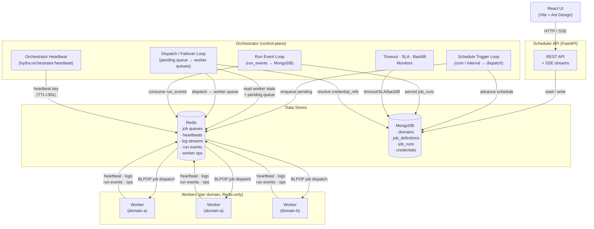

# Hydra Jobs — Architecture

## Component Overview

| Component | Role |
|---|---|
| **Scheduler API** | FastAPI service: REST API + SSE streams. In `api` mode: API only. In `combined` mode (default): API + orchestration loops. |
| **Orchestrator** | Control-plane process: owns all background reconciliation loops (dispatch, failover, schedule, events, monitoring). Can run as a separate process (`python -m scheduler.orchestrator_entrypoint`) or co-located with the API in `combined` mode. |
| **Redis** | Message bus: job queues, worker coordination, heartbeats, log streaming, run events |
| **MongoDB** | Durable store: domains, job definitions, run history, credentials |
| **Workers** | Execution agents: Redis-only at runtime — receive jobs, run them, emit events. Available in Python and Go with feature parity. |
| **UI** | React frontend: monitors jobs/workers/runs via scheduler REST API and SSE |

## Runtime Modes

### Combined mode (default)

Both the API service and all orchestration loops run inside the same process. This is the default for simplicity, local development, and small deployments.

```
HYDRA_MODE=combined  (or unset)
```

Start with the standard Compose file:

```bash
docker compose up --build
```

### Separated mode

The API service and control-plane orchestrator run as separate processes. This gives independent fault domains, restartability, and observability per role.

```
HYDRA_MODE=api          # on the scheduler container
HYDRA_MODE=orchestrator # on the orchestrator container (informational)
```

Start with the separated override:

```bash
docker compose -f docker-compose.yml -f docker-compose.separated.yml up --build
```

### Process ownership summary

| Responsibility | Combined | API process | Orchestrator process |
|---|:---:|:---:|:---:|
| REST API + SSE | ✓ | ✓ | — |
| Schedule advancement (cron/interval) | ✓ | — | ✓ |
| Job dispatch to workers | ✓ | — | ✓ |
| Worker failover + queue drain | ✓ | — | ✓ |
| Run event ingestion (Redis → MongoDB) | ✓ | — | ✓ |
| Timeout enforcement | ✓ | — | ✓ |
| SLA monitoring | ✓ | — | ✓ |
| Backfill dispatch | ✓ | — | ✓ |
| Orchestrator heartbeat | ✓ | — | ✓ |

## Architecture Diagram



> **Note:** In `combined` mode both boxes (`Scheduler API` and `Orchestrator`) run inside the same OS process. In `separated` mode they are distinct processes (or containers) connected only through Redis and MongoDB.

## Orchestration Health

The `OrchestratorManager` (owned by either the combined API process or the standalone orchestrator) writes a heartbeat key to Redis every 10 seconds:

```
hydra:orchestrator:heartbeat  →  {"ts": <unix timestamp>, "loops": ["scheduling", "failover", ...]}
```

The key has a 30-second TTL; if the process dies the key expires automatically.

To check orchestration health:

```bash
GET /health/orchestration
```

Example responses:

```json
{"status": "ok", "age_seconds": 3.2, "loops": ["scheduling", "failover", "schedule_trigger", "run_event", "timeout", "sla", "backfill"]}
{"status": "stale", "age_seconds": 45.1, "loops": [...]}
{"status": "unknown", "message": "No orchestrator heartbeat found. ..."}
```

This lets operators and monitoring systems independently verify:
- `GET /health` — API is up and can serve requests.
- `GET /health/orchestration` — Control-plane loops are running and healthy.

## Data Flow

### Job Submission & Dispatch
1. Client submits a job via `POST /jobs/` → scheduler validates and stores in **MongoDB**.
2. **Schedule Trigger Loop** fires when a cron/interval expression is due and enqueues a run into `job_queue:<domain>:pending` in **Redis**.
3. **Dispatch Loop** picks the best worker using affinity rules, resolves credential refs from **MongoDB**, and pushes the full job envelope to `job_queue:<domain>:<worker_id>` in **Redis**.
4. **Worker** BLPOPs its dedicated queue, executes the job, and streams logs to `log_stream:<domain>:<run_id>` in **Redis**.

### Run Lifecycle Events
5. Worker emits `run_start` and `run_end` events to `run_events:<domain>` in **Redis**.
6. **Run Event Loop** (in scheduler) atomically stages each event via `RPOPLPUSH`, processes it, then removes it from the staging queue.  Run documents are persisted to the `job_runs` collection in **MongoDB**.  See [Run Lifecycle](#run-lifecycle) for full state-transition and idempotency semantics.

### Worker Coordination (Redis-only)
- Workers write registration metadata and heartbeats to `workers:<domain>:<worker_id>` in **Redis**.
- Rolling metrics (memory, CPU, load) are stored in `worker_metrics:<domain>:<worker_id>:history` in **Redis**.
- Operational events (dispatches, state changes, failovers) are logged to `worker_ops:<domain>:<worker_id>` in **Redis**.
- Workers **never connect to MongoDB**.

## Redis Key Layout

| Key Pattern | Owner | Purpose |
|---|---|---|
| `job_queue:<domain>:pending` | Scheduler (write) / Scheduler (read) | Pending jobs waiting for dispatch |
| `job_queue:<domain>:<worker_id>` | Scheduler (write) / Worker (read) | Per-worker dispatch queue |
| `workers:<domain>:<worker_id>` | Worker | Registration metadata + heartbeat |
| `worker_heartbeats:<domain>` | Worker | Heartbeat timestamps |
| `worker_running_set:<domain>:<worker_id>` | Worker | Set of currently running job IDs |
| `job_running:<domain>:<job_id>` | Worker | Concurrency lock per job |
| `worker_metrics:<domain>:<worker_id>:history` | Worker | Rolling metrics history |
| `run_events:<domain>` | Worker (write) / Scheduler (read) | Run lifecycle event stream |
| `worker_ops:<domain>:<worker_id>` | Worker | Operational event log |
| `log_stream:<domain>:<run_id>*` | Worker | Real-time log chunks |

## Security Boundaries

- Each domain has its own **Redis ACL user** (username = domain name). Workers can only access keys and channels scoped to their domain.
- The scheduler's admin token grants cross-domain access; domain tokens scope all other requests.
- **Credentials** (DB URIs, PAT tokens, SMTP passwords) are encrypted in MongoDB and resolved at dispatch time by the scheduler. Workers receive them in the job envelope — they are never returned via the API.

## Executor Types

Both Python and Go workers support the following executor types:

| Type | Description | Notes |
|---|---|---|
| `shell` | Run a shell script (bash/sh) | Default executor |
| `external` | Run an external binary | Direct command execution |
| `python` | Run inline Python code | Python worker has venv/uv support |
| `powershell` | Run PowerShell scripts | Requires pwsh or powershell |
| `batch` | Run Windows batch scripts | Windows only |
| `sql` | Execute SQL queries | Supports postgres, mysql, mssql, oracle, mongodb; uses credential_ref for secrets |
| `http` | Make HTTP requests | REST triggers, webhooks, health checks; supports credential_ref for auth |
| `sensor` | Poll until a condition is met | HTTP or SQL sensor; runs on worker, not scheduler |

### Sensor Executor

Sensor jobs (`executor.type == "sensor"`) are dispatched and executed entirely on workers — the scheduler does **not** perform any external polling. This preserves the architectural boundary that the scheduler orchestrates and persists while workers execute.

A sensor worker thread polls a target at `poll_interval_seconds` intervals until either:
- The condition is met (HTTP: expected status received; SQL: query returns ≥1 row) → `run_end` status `success`
- `timeout_seconds` elapses → `run_end` status `failed`

Credentials (`credential_ref`) for sensor jobs are resolved by the scheduler at dispatch time and injected into the job envelope, exactly as for other executor types. Workers have no MongoDB access.

### Worker Capability Detection

Workers advertise only executor types that pass a concrete preflight check at startup:

| Capability | Preflight check |
|---|---|
| `shell` / `external` | At least one shell binary executes `exit 0` successfully |
| `python` | `HYDRA_PYTHON_PATH` or `python3`/`python` found and executable |
| `powershell` | `pwsh` or `powershell` executes `exit 0` successfully |
| `batch` | Windows OS detected |
| `sql` | Python present **and** `sqlalchemy` or `pymongo` importable |
| `http` | Always available (stdlib `urllib`) |
| `sensor` | Always available (HTTP sensor uses stdlib; SQL sensor requires same as `sql`) |

This fail-closed approach prevents dispatch of jobs to workers that lack the necessary runtime, rather than discovering the gap at execution time.

### Cross-Platform User Control

- **Impersonation**: Jobs can specify `executor.impersonate_user` to run commands as a different user via `sudo -n -u <user>` (Linux/macOS). The scheduler enforces OS affinity — impersonation jobs only dispatch to Linux/macOS workers.
- **Kerberos**: Jobs can specify `executor.kerberos` with `principal`, `keytab`, and optional `ccache` for Kerberos authentication bootstrap before execution.
- **Windows**: Use the service account model — run workers as the target user and use `allowed_users` affinity for routing.

### Workspace Caching

Workers maintain a persistent cache directory for source workspaces. Cache entries are keyed by `(url, ref, path, protocol)` hash and support:
- **LRU eviction** with configurable max size (`WORKER_WORKSPACE_CACHE_MAX_MB`)
- **Configurable TTL metadata** (`WORKER_WORKSPACE_CACHE_TTL`) based on the last recorded cache-use timestamp
- **Git fast-update** (fetch + checkout instead of full clone on cache hit)
- **Cache modes** per job: `auto` (default), `always`, `never`

## Run Lifecycle

### States

| State | Meaning |
|---|---|
| `pending` | Job has been enqueued in `job_queue:<domain>:pending` but not yet dispatched to a worker. |
| `dispatched` | Scheduler has pushed the job envelope to `job_queue:<domain>:<worker_id>`; the worker has not yet acknowledged execution start. |
| `running` | Worker emitted `run_start`; execution is in progress. |
| `success` | Worker emitted `run_end` with `status: success`. **Terminal.** |
| `failed` | Worker emitted `run_end` with `status: failed`, or the failover/timeout loop marked the run as failed. **Terminal.** |
| `timed_out` | Run exceeded its configured `timeout_seconds`; treated equivalently to failed for post-run actions. **Terminal.** |

`success`, `failed`, and `timed_out` are **terminal states**: a run document must not transition out of a terminal state. Post-run actions (scheduler-level retries, on-failure webhooks, e-mail alerts, and dependent-job triggers) fire exactly once when a run first enters a terminal state.

### State Transitions

```
pending → dispatched → running → success
                               → failed
                               → timed_out

failed / timed_out → (re-enqueued as a new run with a fresh run_id)
```

Retries and failover always create a **new** run document with a new `run_id`.  The original run document is preserved in its terminal state so the full history of attempts is available in MongoDB.

### Event Ingestion Semantics

Run lifecycle events are emitted by workers to `run_events:<domain>` in Redis and consumed by the **Run Event Loop** in the scheduler, which persists them to `job_runs` in MongoDB.

#### Idempotency guarantees

- **`run_start`**: Uses MongoDB `$setOnInsert`, which is a no-op if the document already exists.  Duplicate or replayed `run_start` events are dropped without updating the document.  A `run_start` that arrives after `run_end` has already marked the run terminal is also silently ignored.
- **`run_end`**: Guards against updating a document that is already in a terminal state.  Duplicate `run_end` events (including replays after scheduler restart) are detected and dropped before post-run actions can fire.

#### Anomalous sequence handling

| Scenario | Behaviour |
|---|---|
| Duplicate `run_start` | Logged at `WARNING`; no-op update (document unchanged, `append_worker_op` skipped). |
| `run_start` after terminal `run_end` | Logged at `WARNING`; ignored — terminal state is preserved. |
| Duplicate `run_end` (terminal state) | Logged at `WARNING`; entire `_handle_run_end` body skipped — post-run actions do not re-fire. |
| `run_end` before `run_start` | Logged at `WARNING`; a minimal fallback run document is created so the run is visible in history. Post-run actions fire once for this fallback document. |
| Concurrent insert on fallback | Handled via `DuplicateKeyError` catch; post-run actions are skipped if a concurrent `run_start` already committed the document in a terminal state. |

#### Crash-safety (staging queue)

The Run Event Loop uses Redis `RPOPLPUSH` to atomically move each event from `run_events:<domain>` to a per-domain staging queue `run_events:<domain>:processing` **before** processing it.  After successful (or unrecoverable) processing the event is removed from the staging queue with `LREM`.

On scheduler startup, `_recover_staging_events()` scans all `run_events:*:processing` keys and moves any leftover events back to their source queues, ensuring events that were in-flight during a crash are re-delivered.  Because event handlers are idempotent, re-delivery is safe.


Hydra instruments key stages of job execution so operators can observe where time is spent. The following timing fields are included in `run_end` events (and therefore persisted to MongoDB `job_runs`):

| Field | Description |
|---|---|
| `queue_latency_ms` | Time from job enqueue to worker thread start (dispatch latency) |
| `total_run_ms` | Wall-clock time from `run_start` to `run_end` |
| `source_fetch_ms` | Time spent fetching/updating the workspace (git clone, copy, rsync). `null` if no source is configured. |
| `env_prep_ms` | Time to prepare the Python execution environment (venv create, uv install). `null` for non-Python executors. |

Additionally, each worker records `startup_duration_ms` in its registration metadata (`workers:<domain>:<worker_id>`) and in the `start`/`restart` worker operation event. This measures the time from process start to first successful registration, capturing the cost of capability detection, dependency checks, and Redis connection setup.

### Querying timing data

Timing fields are available on `GET /history/` run records. To identify cold-start bottlenecks:

```bash
# Summarise source_fetch_ms for a specific job (using mongosh or any MongoDB client)
db.job_runs.aggregate([
  { $match: { job_id: "my-job-id" } },
  { $group: { _id: null, avg_fetch: { $avg: "$source_fetch_ms" }, p95_total: { $percentile: { input: "$total_run_ms", p: [0.95], method: "approximate" } } } }
])
```
