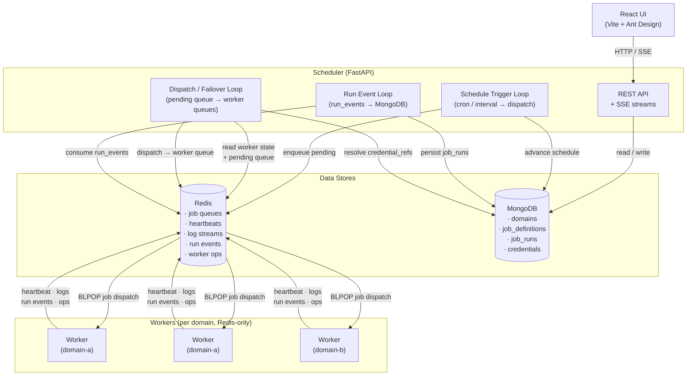

# Hydra Jobs — Architecture

## Component Overview

| Component | Role |
|---|---|
| **Scheduler** | FastAPI service: REST API, job orchestration, scheduling, failover, and persistence |
| **Redis** | Message bus: job queues, worker coordination, heartbeats, log streaming, run events |
| **MongoDB** | Durable store: domains, job definitions, run history, credentials |
| **Workers** | Execution agents: Redis-only at runtime — receive jobs, run them, emit events. Available in Python and Go with feature parity. |
| **UI** | React frontend: monitors jobs/workers/runs via scheduler REST API and SSE |

## Architecture Diagram

## Data Flow

### Job Submission & Dispatch
1. Client submits a job via `POST /jobs/` → scheduler validates and stores in **MongoDB**.
2. **Schedule Trigger Loop** fires when a cron/interval expression is due and enqueues a run into `job_queue:<domain>:pending` in **Redis**.
3. **Dispatch Loop** picks the best worker using affinity rules, resolves credential refs from **MongoDB**, and pushes the full job envelope to `job_queue:<domain>:<worker_id>` in **Redis**.
4. **Worker** BLPOPs its dedicated queue, executes the job, and streams logs to `log_stream:<domain>:<run_id>` in **Redis**.

### Run Lifecycle Events
5. Worker emits `run_start` and `run_end` events to `run_events:<domain>` in **Redis**.
6. **Run Event Loop** (in scheduler) consumes those events and persists run documents to the `job_runs` collection in **MongoDB**.

### Worker Coordination (Redis-only)
- Workers write registration metadata and heartbeats to `workers:<domain>:<worker_id>` in **Redis**.
- Rolling metrics (memory, CPU, load) are stored in `worker_metrics:<domain>:<worker_id>:history` in **Redis**.
- Operational events (dispatches, state changes, failovers) are logged to `worker_ops:<domain>:<worker_id>` in **Redis**.
- Workers **never connect to MongoDB**.

## Redis Key Layout

| Key Pattern | Owner | Purpose |
|---|---|---|
| `job_queue:<domain>:pending` | Scheduler (write) / Scheduler (read) | Pending jobs waiting for dispatch |
| `job_queue:<domain>:<worker_id>` | Scheduler (write) / Worker (read) | Per-worker dispatch queue |
| `workers:<domain>:<worker_id>` | Worker | Registration metadata + heartbeat |
| `worker_heartbeats:<domain>` | Worker | Heartbeat timestamps |
| `worker_running_set:<domain>:<worker_id>` | Worker | Set of currently running job IDs |
| `job_running:<domain>:<job_id>` | Worker | Concurrency lock per job |
| `worker_metrics:<domain>:<worker_id>:history` | Worker | Rolling metrics history |
| `run_events:<domain>` | Worker (write) / Scheduler (read) | Run lifecycle event stream |
| `worker_ops:<domain>:<worker_id>` | Worker | Operational event log |
| `log_stream:<domain>:<run_id>*` | Worker | Real-time log chunks |

## Security Boundaries

- Each domain has its own **Redis ACL user** (username = domain name). Workers can only access keys and channels scoped to their domain.
- The scheduler's admin token grants cross-domain access; domain tokens scope all other requests.
- **Credentials** (DB URIs, PAT tokens, SMTP passwords) are encrypted in MongoDB and resolved at dispatch time by the scheduler. Workers receive them in the job envelope — they are never returned via the API.

## Executor Types

Both Python and Go workers support the following executor types:

| Type | Description | Notes |
|---|---|---|
| `shell` | Run a shell script (bash/sh) | Default executor |
| `external` | Run an external binary | Direct command execution |
| `python` | Run inline Python code | Python worker has venv/uv support |
| `powershell` | Run PowerShell scripts | Requires pwsh or powershell |
| `batch` | Run Windows batch scripts | Windows only |
| `sql` | Execute SQL queries | Supports postgres, mysql, mssql, oracle, mongodb; uses credential_ref for secrets |
| `http` | Make HTTP requests | REST triggers, webhooks, health checks; supports credential_ref for auth |

### Cross-Platform User Control

- **Impersonation**: Jobs can specify `executor.impersonate_user` to run commands as a different user via `sudo -n -u <user>` (Linux/macOS). The scheduler enforces OS affinity — impersonation jobs only dispatch to Linux/macOS workers.
- **Kerberos**: Jobs can specify `executor.kerberos` with `principal`, `keytab`, and optional `ccache` for Kerberos authentication bootstrap before execution.
- **Windows**: Use the service account model — run workers as the target user and use `allowed_users` affinity for routing.

### Workspace Caching

Workers maintain a persistent cache directory for source workspaces. Cache entries are keyed by `(url, ref, path, protocol)` hash and support:
- **LRU eviction** with configurable max size (`WORKER_WORKSPACE_CACHE_MAX_MB`)
- **Configurable TTL metadata** (`WORKER_WORKSPACE_CACHE_TTL`) based on the last recorded cache-use timestamp
- **Git fast-update** (fetch + checkout instead of full clone on cache hit)
- **Cache modes** per job: `auto` (default), `always`, `never`
